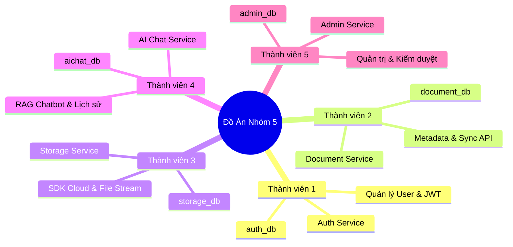
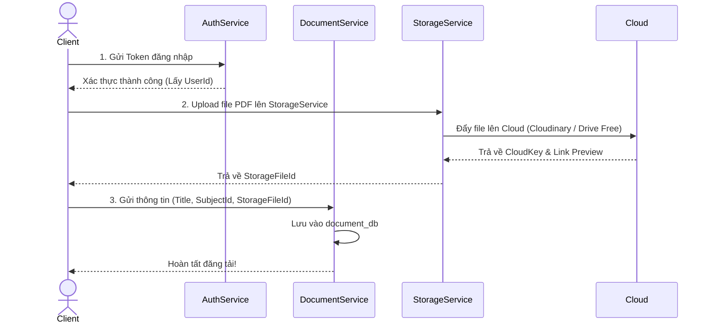

# Scientific Journal & Document Management System with AI Chatbot

Hệ thống Quản lý Tài liệu, Theo dõi Bài báo Khoa học và Hỏi đáp thông minh với AI Chatbot (RAG). Dự án được xây dựng theo kiến trúc **Microservices** trên nền tảng **.NET 8.0** kết hợp với **PostgreSQL** để lưu trữ dữ liệu.

---

## 1. Context (Bối cảnh)
Trong môi trường học thuật, số lượng tài liệu, giáo trình và bài báo nghiên cứu khoa học ngày càng lớn. Việc lưu trữ, tìm kiếm, tra cứu thông tin chi tiết và cập nhật các xu hướng nghiên cứu học thuật mới từ các nguồn dữ liệu thế giới (Semantic Scholar, OpenAlex) tốn rất nhiều thời gian. Hệ thống ra đời nhằm cung cấp giải pháp trọn gói: từ quản lý tài liệu nội bộ, lưu trữ Cloud, đến tích hợp Worker tự động kéo metadata bài báo khoa học và tích hợp trợ lý AI thông minh hỏi đáp nội dung tài liệu.

## 2. Problems (Vấn đề)
- Khó khăn trong việc tìm kiếm, lưu trữ và phân loại tài liệu/bài báo theo từng môn học/lĩnh vực (ví dụ: AI, Computer Science).
- Cần tự động hóa việc thu thập thông tin (metadata) bài báo khoa học từ các nguồn uy tín thế giới mà không vi phạm bản quyền.
- Người dùng mất nhiều thời gian đọc tài liệu dài chỉ để tìm thông tin cụ thể, cần AI Chatbot hỗ trợ tóm tắt và tra cứu.

## 3. Primary Actors (Đối tượng sử dụng chính)
- **Researcher / Student (Nhà nghiên cứu / Sinh viên):** Đăng nhập, tìm kiếm bài báo khoa học, upload tài liệu, lọc theo môn học, chat với AI Chatbot để hỏi đáp.
- **Teacher / Lecturer (Giảng viên):** Đăng tải giáo trình, quản lý danh mục tài liệu và đề xuất các bài báo nghiên cứu cho môn học.
- **System Administrator (Quản trị hệ thống):** Quản lý tài khoản, cấu hình nguồn dữ liệu API bên thứ 3 (Semantic Scholar/OpenAlex), kiểm duyệt tài liệu và theo dõi thống kê.

---

## 4. Functional Requirements (Yêu cầu chức năng)

1. **Authentication (Xác thực & Người dùng)**
   - Đăng ký tài khoản
   - Đăng nhập, Đăng xuất (JWT, Refresh Token)
   - Quên mật khẩu / Đổi mật khẩu
   - Cập nhật Profile cá nhân

2. **Document & Paper Management (Quản lý Tài liệu & Bài báo)**
   - Quản lý tài liệu do người dùng upload và bài báo tự động kéo về từ API bên thứ 3.
   - Xem danh sách, xem chi tiết metadata (Tiêu đề, Tác giả, Journal, Abstract, Năm XB).
   - Xóa, chỉnh sửa thông tin tài liệu.
   - Tìm kiếm và Lọc tài liệu theo môn học/lĩnh vực.

3. **Cloud Storage (Lưu trữ đám mây)**
   - Upload file trực tiếp lên Cloud.
   - Theo dõi trạng thái upload.
   - Cung cấp link Download và Preview file.

4. **AI Chatbot (Hỏi đáp AI RAG)**
   - Chat trực tiếp với AI Chatbot (Gemini / OpenAI).
   - Hỏi đáp về nội dung tài liệu hoặc bài báo khoa học.
   - Xem và quản lý lịch sử các phiên chat.

---

## 5. Notes (Ghi chú hệ thống - Tích hợp API học thuật)
- Hệ thống sử dụng dữ liệu công khai từ các nguồn học thuật như **Semantic Scholar, OpenAlex hoặc Crossref** thông qua API miễn phí.
- Chỉ thu thập metadata của bài báo: `Title`, `Abstract`, `Authors`, `Publication Year`, `Journal`.
- Không xử lý toàn văn (full-text) của bài báo do giới hạn bản quyền.
- Tần suất cập nhật dữ liệu chạy tự động theo chu kỳ định kỳ (Background Worker / Cronjob mỗi ngày/tuần), **không yêu cầu realtime**.

---

## 6. Danh Sách Các Microservices & Phân Công Nhiệm Vụ (Nhóm 5 Thành Viên)

Dự án áp dụng triệt để mô hình **Database-per-service**. Mỗi service chạy độc lập với cơ sở dữ liệu riêng và được giao cho 1 thành viên chịu trách nhiệm hoàn toàn:



### 🧑‍💻 Thành viên 1: Quản lý Xác thực & Tài khoản (`AuthService` - DB: `auth_db`)
* `POST /api/auth/register`: Đăng ký tài khoản (BCrypt/Argon2).
* `POST /api/auth/login`: Xác thực đăng nhập, cấp JWT Access Token & Refresh Token.
* `POST /api/auth/refresh-token`: Cập nhật Access Token mới.
* `POST /api/auth/logout`: Đăng xuất (thu hồi Refresh Token).
* `POST /api/auth/forgot-password`: Quên mật khẩu.
* `GET /api/auth/profile`: Lấy thông tin cá nhân.
* `PUT /api/auth/profile`: Cập nhật thông tin cá nhân.

### 🧑‍💻 Thành viên 2: Quản lý Tài liệu & Đồng bộ Học thuật (`DocumentService` - DB: `document_db`)
* `GET /api/subjects`: Lấy danh sách môn học / lĩnh vực.
* `POST /api/documents`: Đăng tải thông tin tài liệu mới.
* `GET /api/documents`: Xem danh sách tài liệu / bài báo (phân trang, lọc theo môn học, nguồn).
* `GET /api/documents/{id}`: Xem chi tiết tài liệu / bài báo.
* `PUT /api/documents/{id}`: Chỉnh sửa thông tin tài liệu.
* `DELETE /api/documents/{id}`: Xóa tài liệu.
* **Background Worker (Sync Task):** Chạy ngầm định kỳ kéo metadata bài báo từ Semantic Scholar / OpenAlex.

### 🧑‍💻 Thành viên 3: Quản lý File & Lưu trữ Đám mây (`StorageService` - DB: `storage_db`)
* **💡 Giải pháp Cloud MIỄN PHÍ 100% cho Sinh viên làm đồ án:**
  * **Cách 1 - Cloudinary (Khuyên dùng):** Gói Free Tier 25GB lưu trữ miễn phí, băng thông thoải mái, có sẵn thư viện `CloudinaryDotNet` cực dễ dùng, hỗ trợ link preview PDF/ảnh mượt mà.
  * **Cách 2 - Google Drive API:** Dùng tài khoản Google Drive cá nhân (15GB Free), tạo Service Account/OAuth credential miễn phí, quản lý qua thư viện `Google.Apis.Drive.v3`.
  * **Cách 3 - MinIO (Docker Local S3):** Nếu thầy bắt buộc demo chuẩn AWS S3 nhưng không tốn tiền, chỉ cần dựng container MinIO (S3-compatible) chạy dưới máy local hoàn toàn miễn phí.
* `POST /api/storage/upload`: Stream upload file lên Cloud (Cloudinary / Drive Free).
* `GET /api/storage/status/{id}`: Theo dõi trạng thái tiến trình upload.
* `GET /api/storage/preview/{id}`: Lấy link xem trước (preview) tài liệu trên trình duyệt.
* `GET /api/storage/download/{id}`: Lấy link tải xuống trực tiếp.
* `DELETE /api/storage/{id}`: Xóa file vật lý trên Cloud.

### 🧑‍💻 Thành viên 4: Trợ lý AI Hỏi Đáp (`AIChatService` - DB: `aichat_db`)
* `POST /api/chat/sessions`: Tạo phiên trò chuyện mới (hỗ trợ gắn DocumentId để RAG).
* `GET /api/chat/sessions`: Lấy danh sách phiên chat.
* `GET /api/chat/sessions/{sessionId}/messages`: Lấy chi tiết lịch sử tin nhắn.
* `POST /api/chat/ask`: Gửi câu hỏi cho AI (Gemini Free API / OpenAI) hỏi đáp trên nội dung tài liệu.
* `DELETE /api/chat/sessions/{sessionId}`: Xóa lịch sử chat.

### 🧑‍💻 Thành viên 5: Quản trị Hệ thống & Kiểm duyệt (`AdminService` - DB: `admin_db`)
* `GET /api/admin/configs`: Xem cấu hình hệ thống.
* `PUT /api/admin/configs`: Sửa cấu hình runtime.
* `POST /api/admin/moderate/document/{id}`: Kiểm duyệt, phê duyệt/gỡ bỏ tài liệu (lưu Audit Log).
* `POST /api/admin/moderate/user/{id}`: Khóa/mở khóa tài khoản.
* `GET /api/admin/audit-logs`: Xem lịch sử kiểm duyệt.
* `GET /api/admin/analytics`: Thống kê tổng quan (số user, tài liệu theo môn học, lượt tải).

---

## 7. Hướng dẫn phối hợp nhóm (Luồng Upload Tài liệu)


---

## 8. Yêu cầu cài đặt
- [.NET 8.0 SDK](https://dotnet.microsoft.com/en-us/download/dotnet/8.0)
- [Docker & Docker Compose](https://www.docker.com/products/docker-desktop/)
- IDE được khuyến nghị: Visual Studio 2022 hoặc Visual Studio Code.

---

## 9. Hướng dẫn khởi chạy (Local)

### Bước 1: Khởi tạo Database
```bash
docker-compose up -d
```

### Bước 2: Khởi chạy Microservices
```bash
dotnet run
```

---

## 10. Ghi chú Kiến trúc
- Dự án sử dụng **Entity Framework Core 8.0** (`Npgsql.EntityFrameworkCore.PostgreSQL`).
- Do áp dụng Microservice Database-per-service, KHÔNG có ràng buộc khóa ngoại (Foreign Key) chéo giữa các database. Các liên kết bằng `UUID` sẽ do Service tự quản lý và xác thực thông qua API call nội bộ.
