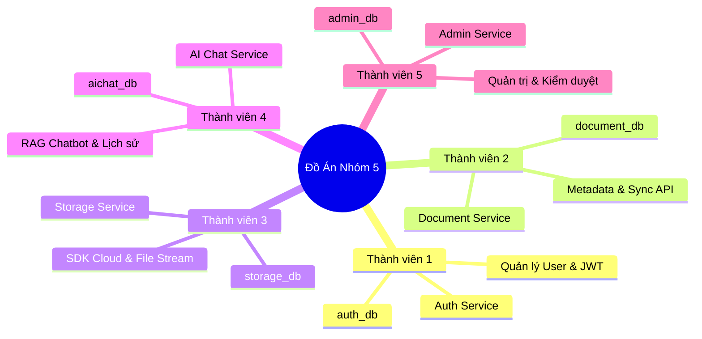
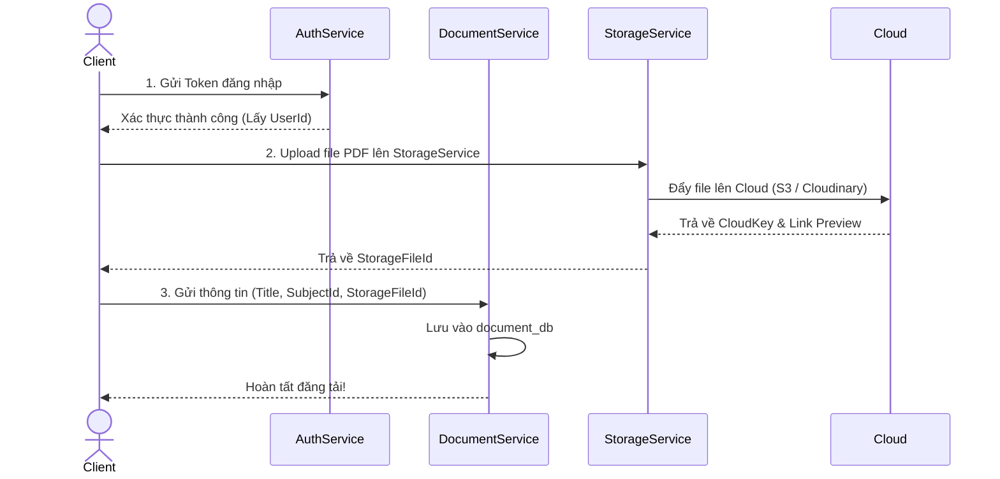

# Bảng Phân Công Nhiệm Vụ 5 Microservices (Nhóm 5 Thành Viên)

Bảng phân công này được thiết kế để đảm bảo khối lượng công việc công bằng, không chồng chéo code, mỗi người làm chủ hoàn toàn một Service và một Database riêng biệt theo đúng chuẩn mô hình Microservices của đề tài.

---

## 🧑‍💻 Thành viên 1: Quản lý Xác thực & Tài khoản (`AuthService`)
* **Database phụ trách:** `auth_db` (Bảng `Users`, `RefreshTokens`).
* **Vai trò:** Đảm bảo an ninh và xác thực danh tính cho toàn bộ hệ thống (Yêu cầu chức năng 1).

### Danh sách API cần phát triển:
1. `POST /api/auth/register`: Đăng ký tài khoản mới (mã hóa mật khẩu bằng BCrypt/Argon2).
2. `POST /api/auth/login`: Xác thực thông tin đăng nhập, sinh chuỗi Access Token (JWT) và Refresh Token.
3. `POST /api/auth/refresh-token`: Cấp lại Access Token mới khi token cũ hết hạn.
4. `POST /api/auth/logout`: Đăng xuất (thu hồi Refresh Token).
5. `POST /api/auth/forgot-password`: Xử lý quên mật khẩu (gửi email reset).
6. `GET /api/auth/profile`: Lấy thông tin cá nhân của User đang đăng nhập.
7. `PUT /api/auth/profile`: Cập nhật thông tin profile (họ tên, avatar).

---

## 🧑‍💻 Thành viên 2: Quản lý Tài liệu & Đồng bộ Học thuật (`DocumentService`)
* **Database phụ trách:** `document_db` (Bảng `Subjects`, `Documents`).
* **Vai trò:** Trái tim của hệ thống lưu trữ dữ liệu tài liệu nội bộ và các bài báo khoa học kéo từ API quốc tế (Yêu cầu 2 & Ghi chú hệ thống).

### Danh sách API & Task cần phát triển:
1. `GET /api/subjects`: Lấy danh sách môn học/lĩnh vực (dùng cho bộ lọc).
2. `POST /api/documents`: Tạo mới hồ sơ tài liệu (khi người dùng upload file).
3. `GET /api/documents`: Lấy danh sách tài liệu (hỗ trợ phân trang, tìm kiếm theo `title`/`authors`, lọc theo `subject_id` hoặc `external_source`).
4. `GET /api/documents/{id}`: Xem chi tiết thông tin metadata của tài liệu/bài báo.
5. `PUT /api/documents/{id}`: Chỉnh sửa thông tin metadata tài liệu.
6. `DELETE /api/documents/{id}`: Xóa tài liệu (chỉ áp dụng với tài liệu do chính User đó upload).
7. **Background Worker (Sync Task):** Viết một `BackgroundService` chạy ngầm định kỳ (mỗi ngày 1 lần) gọi API miễn phí của Semantic Scholar hoặc OpenAlex để lấy danh sách bài báo mới thuộc lĩnh vực CS/AI và lưu tự động vào DB.

---

## 🧑‍💻 Thành viên 3: Quản lý File & Lưu trữ Đám mây (`StorageService`)
* **Database phụ trách:** `storage_db` (Bảng `StorageFiles`).
* **Vai trò:** Xử lý luồng file vật lý dung lượng lớn và giao tiếp trực tiếp với SDK Cloud (AWS S3, Cloudinary hoặc Google Drive).

### Danh sách API cần phát triển:
1. `POST /api/storage/upload`: Nhận file stream từ client, đẩy thẳng lên Cloud Storage, lưu thông tin vào bảng `StorageFiles` với trạng thái `Uploading`/`Completed`.
2. `GET /api/storage/status/{id}`: Kiểm tra tiến trình và trạng thái upload file.
3. `GET /api/storage/preview/{id}`: Trả về URL an toàn để xem trước (preview) file pdf/ảnh trên trình duyệt.
4. `GET /api/storage/download/{id}`: Trả về URL tải xuống (download) trực tiếp.
5. `DELETE /api/storage/{id}`: Xóa file vật lý trên Cloud khi tài liệu bị xóa.

---

## 🧑‍💻 Thành viên 4: Trợ lý AI Hỏi Đáp (`AIChatService`)
* **Database phụ trách:** `aichat_db` (Bảng `ChatSessions`, `ChatMessages`).
* **Vai trò:** Tích hợp trí tuệ nhân tạo (LLM) hỗ trợ sinh viên/nhà nghiên cứu hỏi đáp nội dung chuyên sâu của bài báo (Yêu cầu chức năng 4).

### Danh sách API cần phát triển:
1. `POST /api/chat/sessions`: Khởi tạo một phiên trò chuyện mới (có thể chọn gắn với một `DocumentId` cụ thể hoặc chat tự do).
2. `GET /api/chat/sessions`: Lấy danh sách các phiên chat của User đang đăng nhập.
3. `GET /api/chat/sessions/{sessionId}/messages`: Lấy toàn bộ lịch sử tin nhắn trong một phiên chat.
4. `POST /api/chat/ask`: Gửi câu hỏi của User. Service sẽ kết nối API của Google Gemini hoặc OpenAI, áp dụng kỹ thuật RAG (Retrieval-Augmented Generation) lấy tóm tắt/abstract của tài liệu làm ngữ cảnh, và trả về câu trả lời cho Client.
5. `DELETE /api/chat/sessions/{sessionId}`: Xóa lịch sử phiên chat.

---

## 🧑‍💻 Thành viên 5: Quản trị Hệ thống & Kiểm duyệt (`AdminService`)
* **Database phụ trách:** `admin_db` (Bảng `SystemConfigs`, `AuditLogs`).
* **Vai trò:** Đảm bảo trật tự, giám sát tài nguyên và phân tích hoạt động của toàn bộ hệ thống.

### Danh sách API cần phát triển:
1. `GET /api/admin/configs`: Xem danh sách cấu hình hệ thống (vd: dung lượng tối đa, model AI đang dùng).
2. `PUT /api/admin/configs`: Cập nhật cấu hình hệ thống runtime (không cần restart server).
3. `POST /api/admin/moderate/document/{id}`: Admin kiểm duyệt, phê duyệt (`Approved`) hoặc gỡ bỏ (`Rejected`) tài liệu vi phạm. Ghi tự động vào bảng `AuditLogs`.
4. `POST /api/admin/moderate/user/{id}`: Admin khóa (`Locked`) hoặc mở khóa (`Active`) tài khoản người dùng vi phạm.
5. `GET /api/admin/audit-logs`: Xem lịch sử thao tác kiểm duyệt của hệ thống.
6. `GET /api/admin/analytics`: API thống kê tổng quan (số tài liệu theo môn học, tổng số user, tổng lượt tải/xem).

---

## 📋 Hướng dẫn phối hợp nhóm (Workflow Upload Tài liệu)
Để các bạn dễ hình dung cách các service giao tiếp với nhau khi một sinh viên upload tài liệu mới:

